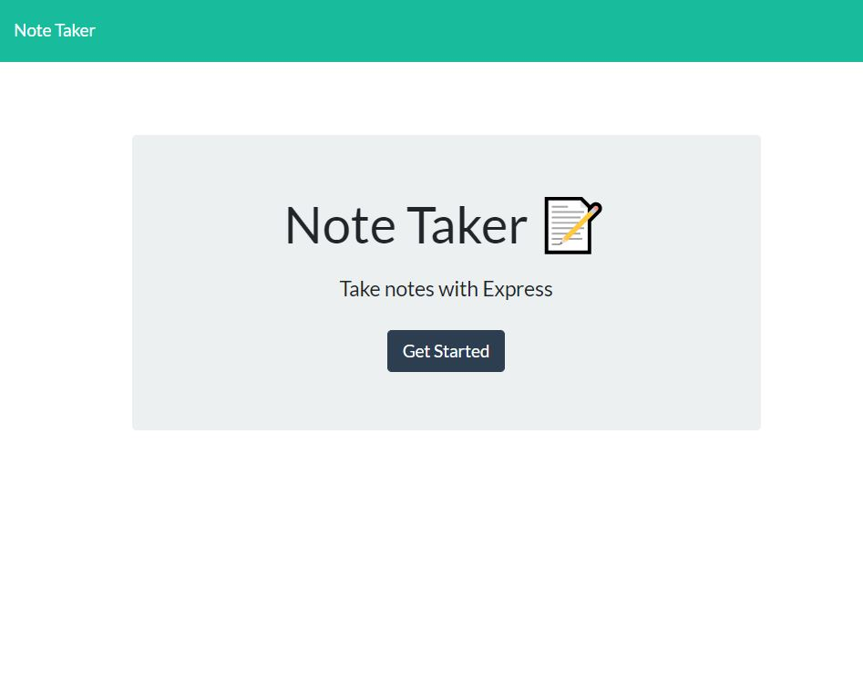
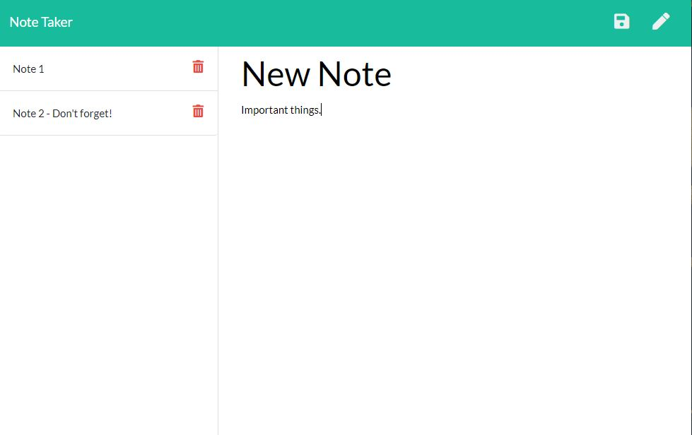

# Note Taker


## Table of Contents
* [Description](#description)
* [Dependencies](#dependencies)
* [Usage](#usage)
* [Links](#links)
* [License](#license)

## Description
Note Taker is an application that can be used to write, save and delete notes. The application uses and Express backend to save and retrieve note data from a JSON file.

## Dependencies
The dependencies are [express](http://expressjs.com/) for the web framework. There is a `package.json`, the following commands should be run to install dependencies:

```bash
npm i
```

## Usage
Use the links below to use the application or if you are running the application from your computer, you can use the following command:
```bash
node server.js
```

The application displays a home page, the user can click Get Started button to get to the Notes page. On the Notes page, the user can enter in text for a new note, navigate and display a previously saved note or delete a previously saved note. 

See Screenshots:



## Links
* Github Link: https://github.com/SeattleSal/note_taker
* Heroku: https://seattlesal-notes-taker.herokuapp.com/

## License

MIT License

Copyright (c) [2020] [Sally Perez]

Permission is hereby granted, free of charge, to any person obtaining a copy
of this software and associated documentation files (the "Software"), to deal
in the Software without restriction, including without limitation the rights
to use, copy, modify, merge, publish, distribute, sublicense, and/or sell
copies of the Software, and to permit persons to whom the Software is
furnished to do so, subject to the following conditions:

The above copyright notice and this permission notice shall be included in all
copies or substantial portions of the Software.

THE SOFTWARE IS PROVIDED "AS IS", WITHOUT WARRANTY OF ANY KIND, EXPRESS OR
IMPLIED, INCLUDING BUT NOT LIMITED TO THE WARRANTIES OF MERCHANTABILITY,
FITNESS FOR A PARTICULAR PURPOSE AND NONINFRINGEMENT. IN NO EVENT SHALL THE
AUTHORS OR COPYRIGHT HOLDERS BE LIABLE FOR ANY CLAIM, DAMAGES OR OTHER
LIABILITY, WHETHER IN AN ACTION OF CONTRACT, TORT OR OTHERWISE, ARISING FROM,
OUT OF OR IN CONNECTION WITH THE SOFTWARE OR THE USE OR OTHER DEALINGS IN THE
SOFTWARE.